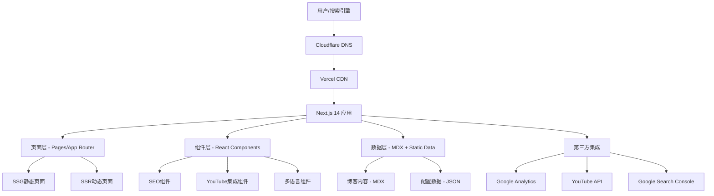
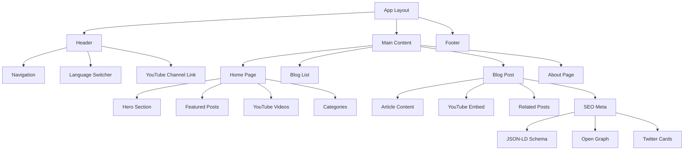

# 设计文档

## 概述

本设计文档基于郭春林多语言个人品牌博客网站的需求，采用现代化的Next.js技术栈，实现SEO优化和YouTube引流的核心目标。系统将支持中英文双语，通过服务端渲染(SSR)和静态生成(SSG)确保最佳的搜索引擎优化效果，同时利用Vercel平台实现免费部署和全球CDN加速。

## 架构设计

### 整体架构



### 技术栈选择

**前端框架：** Next.js 14 (App Router)
- 服务端渲染(SSR)确保SEO友好
- 静态生成(SSG)提供极致性能
- 内置图片优化和字体优化
- 自动代码分割和懒加载

**样式方案：** Tailwind CSS
- 原子化CSS，构建速度快
- 响应式设计支持
- 深色模式支持
- 自定义主题配置

**内容管理：** MDX + 本地文件系统
- Markdown + React组件混合
- 版本控制友好
- 构建时内容处理
- 灵活的内容结构

**部署平台：** Vercel
- 自动部署和预览
- 全球CDN加速
- 图片优化服务
- 分析和监控工具

## 组件设计

### 核心组件架构



### SEO组件设计

**SEOHead组件**
```typescript
interface SEOHeadProps {
  title: string;
  description: string;
  keywords?: string[];
  author?: string;
  publishedTime?: string;
  modifiedTime?: string;
  image?: string;
  url: string;
  locale: 'zh-CN' | 'en-US';
  type?: 'website' | 'article';
}
```

**StructuredData组件**
- Person Schema (郭春林个人信息)
- Article Schema (博客文章)
- VideoObject Schema (YouTube视频)
- Organization Schema (个人品牌)
- BreadcrumbList Schema (导航路径)

### YouTube集成组件

**YouTubeEmbed组件**
```typescript
interface YouTubeEmbedProps {
  videoId: string;
  title: string;
  description?: string;
  thumbnail?: string;
  lazy?: boolean;
  autoplay?: boolean;
}
```

**YouTubeChannelWidget组件**
- 频道信息展示
- 最新视频列表
- 订阅按钮
- 播放量统计

### 多语言组件

**LanguageSwitcher组件**
- 中英文切换
- URL路径处理
- 语言状态管理
- SEO友好的hreflang标签

## 数据模型

### 内容数据结构

**博客文章模型**
```typescript
interface BlogPost {
  id: string;
  slug: string;
  title: {
    zh: string;
    en: string;
  };
  description: {
    zh: string;
    en: string;
  };
  content: {
    zh: string; // MDX content
    en: string; // MDX content
  };
  author: string;
  publishedAt: Date;
  updatedAt: Date;
  tags: string[];
  category: string;
  featured: boolean;
  youtubeVideoId?: string;
  seoKeywords: {
    zh: string[];
    en: string[];
  };
}
```

**分类模型**
```typescript
interface Category {
  id: string;
  name: {
    zh: string;
    en: string;
  };
  slug: string;
  description: {
    zh: string;
    en: string;
  };
  color: string;
  icon: string;
}
```

**网站配置模型**
```typescript
interface SiteConfig {
  name: {
    zh: string;
    en: string;
  };
  description: {
    zh: string;
    en: string;
  };
  author: {
    name: string;
    bio: {
      zh: string;
      en: string;
    };
    avatar: string;
    social: {
      youtube: string;
      twitter?: string;
      linkedin?: string;
    };
  };
  seo: {
    keywords: {
      zh: string[];
      en: string[];
    };
    defaultImage: string;
  };
}
```

## 路由设计

### URL结构

**中文版本**
```
/ - 首页
/posts - 博客列表
/posts/[slug] - 博客详情
/categories/[category] - 分类页面
/about - 关于页面
/sitemap.xml - 站点地图
/robots.txt - 爬虫指令
```

**英文版本**
```
/en - 英文首页
/en/posts - 英文博客列表
/en/posts/[slug] - 英文博客详情
/en/categories/[category] - 英文分类页面
/en/about - 英文关于页面
```

### 动态路由处理

**多语言路由中间件**
```typescript
// middleware.ts
export function middleware(request: NextRequest) {
  const pathname = request.nextUrl.pathname;
  const pathnameIsMissingLocale = locales.every(
    (locale) => !pathname.startsWith(`/${locale}/`) && pathname !== `/${locale}`
  );

  if (pathnameIsMissingLocale) {
    return NextResponse.redirect(
      new URL(`/zh${pathname}`, request.url)
    );
  }
}
```

## 错误处理

### SEO错误处理

**404页面优化**
- 自定义404页面
- 相关内容推荐
- 搜索功能
- 正确的HTTP状态码

**重定向策略**
- 旧URL到新URL的301重定向
- 语言版本间的重定向
- 移动端适配重定向

### 性能错误处理

**图片加载失败**
- 占位符显示
- 重试机制
- 降级处理

**YouTube视频加载失败**
- 缩略图展示
- 链接跳转
- 错误提示

## 测试策略

### SEO测试

**技术SEO测试**
- Meta标签完整性检查
- 结构化数据验证
- 页面加载速度测试
- Core Web Vitals监控

**内容SEO测试**
- 关键词密度分析
- 标题优化检查
- 内链结构验证
- 重复内容检测

### 功能测试

**多语言测试**
- 语言切换功能
- 内容翻译准确性
- URL结构正确性
- SEO标签本地化

**YouTube集成测试**
- 视频嵌入功能
- 播放器响应式
- 链接跳转正确性
- 加载性能测试

### 性能测试

**Core Web Vitals**
- LCP (Largest Contentful Paint) < 2.5s
- FID (First Input Delay) < 100ms
- CLS (Cumulative Layout Shift) < 0.1

**移动端测试**
- 响应式设计
- 触摸友好性
- 移动端加载速度
- 移动端SEO优化
#
# 部署架构

### Vercel部署配置

**vercel.json配置**
```json
{
  "buildCommand": "npm run build",
  "outputDirectory": ".next",
  "framework": "nextjs",
  "functions": {
    "app/api/**/*.ts": {
      "runtime": "nodejs18.x"
    }
  },
  "rewrites": [
    {
      "source": "/sitemap.xml",
      "destination": "/api/sitemap"
    },
    {
      "source": "/robots.txt",
      "destination": "/api/robots"
    }
  ],
  "headers": [
    {
      "source": "/(.*)",
      "headers": [
        {
          "key": "X-Content-Type-Options",
          "value": "nosniff"
        },
        {
          "key": "X-Frame-Options",
          "value": "DENY"
        }
      ]
    }
  ]
}
```

### Cloudflare DNS配置

**DNS记录设置**
- A记录：@ → Vercel IP
- CNAME记录：www → 主域名
- CNAME记录：en → 主域名（多语言支持）

**安全设置**
- SSL/TLS加密模式：完全（严格）
- 始终使用HTTPS：开启
- HSTS：启用
- 最小TLS版本：1.2

## 性能优化策略

### 图片优化

**Next.js Image组件配置**
```typescript
// next.config.js
const nextConfig = {
  images: {
    domains: ['img.youtube.com', 'i.ytimg.com'],
    formats: ['image/webp', 'image/avif'],
    deviceSizes: [640, 750, 828, 1080, 1200, 1920, 2048, 3840],
    imageSizes: [16, 32, 48, 64, 96, 128, 256, 384],
  },
}
```

**图片处理策略**
- WebP格式优先
- 响应式图片
- 懒加载实现
- 占位符模糊效果

### 代码分割

**动态导入策略**
```typescript
// 动态导入YouTube组件
const YouTubeEmbed = dynamic(() => import('@/components/YouTubeEmbed'), {
  loading: () => <div className="animate-pulse bg-gray-200 h-64 rounded" />,
  ssr: false
});

// 动态导入分析组件
const Analytics = dynamic(() => import('@/components/Analytics'), {
  ssr: false
});
```

### 缓存策略

**静态资源缓存**
- 图片：1年缓存
- CSS/JS：1年缓存（带版本号）
- HTML：1小时缓存

**API缓存**
- 博客内容：构建时生成，长期缓存
- YouTube数据：1小时缓存
- 分析数据：实时获取

## 监控和分析

### SEO监控

**Google Search Console集成**
- 搜索性能监控
- 索引状态检查
- 移动端可用性
- Core Web Vitals报告

**关键词排名监控**
```typescript
interface SEOMetrics {
  keyword: string;
  position: number;
  clicks: number;
  impressions: number;
  ctr: number;
  language: 'zh' | 'en';
  date: Date;
}
```

### 用户行为分析

**Google Analytics 4配置**
```typescript
// gtag配置
gtag('config', 'GA_MEASUREMENT_ID', {
  page_title: document.title,
  page_location: window.location.href,
  content_group1: 'Blog', // 内容分组
  content_group2: locale, // 语言分组
  custom_map: {
    'custom_parameter_1': 'youtube_click'
  }
});
```

**自定义事件追踪**
- YouTube视频点击
- 语言切换
- 文章阅读时长
- 外链点击

### 性能监控

**Web Vitals监控**
```typescript
import { getCLS, getFID, getFCP, getLCP, getTTFB } from 'web-vitals';

function sendToAnalytics(metric) {
  gtag('event', metric.name, {
    event_category: 'Web Vitals',
    value: Math.round(metric.name === 'CLS' ? metric.value * 1000 : metric.value),
    event_label: metric.id,
    non_interaction: true,
  });
}

getCLS(sendToAnalytics);
getFID(sendToAnalytics);
getFCP(sendToAnalytics);
getLCP(sendToAnalytics);
getTTFB(sendToAnalytics);
```

## 安全考虑

### 内容安全

**CSP (Content Security Policy)**
```typescript
const securityHeaders = [
  {
    key: 'Content-Security-Policy',
    value: `
      default-src 'self';
      script-src 'self' 'unsafe-eval' 'unsafe-inline' *.youtube.com *.google-analytics.com;
      style-src 'self' 'unsafe-inline' *.googleapis.com;
      img-src 'self' data: blob: *.youtube.com *.ytimg.com;
      font-src 'self' *.googleapis.com *.gstatic.com;
      connect-src 'self' *.google-analytics.com;
      frame-src 'self' *.youtube.com;
    `.replace(/\s{2,}/g, ' ').trim()
  }
];
```

### 数据保护

**GDPR合规**
- Cookie同意横幅
- 隐私政策页面
- 数据处理透明度
- 用户数据控制权

**输入验证**
- MDX内容安全解析
- XSS防护
- CSRF保护

## 维护和更新

### 内容更新流程

**Git工作流**
1. 创建新分支
2. 编辑MDX文件
3. 本地预览测试
4. 提交并推送
5. Vercel自动部署

**内容审核**
- SEO检查清单
- 多语言内容对照
- 链接有效性验证
- 图片优化检查

### 系统维护

**依赖更新**
- 定期更新Next.js版本
- 安全补丁及时应用
- 第三方库版本管理

**性能优化**
- 定期性能审计
- Core Web Vitals监控
- 用户体验改进

## 扩展性设计

### 功能扩展

**评论系统**
- 第三方评论服务集成
- 社交登录支持
- 垃圾评论过滤

**搜索功能**
- 全文搜索实现
- 多语言搜索支持
- 搜索结果优化

**邮件订阅**
- 邮件列表管理
- 自动化邮件发送
- 订阅者分析

### 技术扩展

**CMS集成**
- Headless CMS支持
- 可视化编辑器
- 内容工作流管理

**API扩展**
- RESTful API设计
- GraphQL支持
- 第三方集成接口

这个设计文档为郭春林的SEO优化博客网站提供了完整的技术架构和实施方案，确保项目能够高效实现所有需求目标。